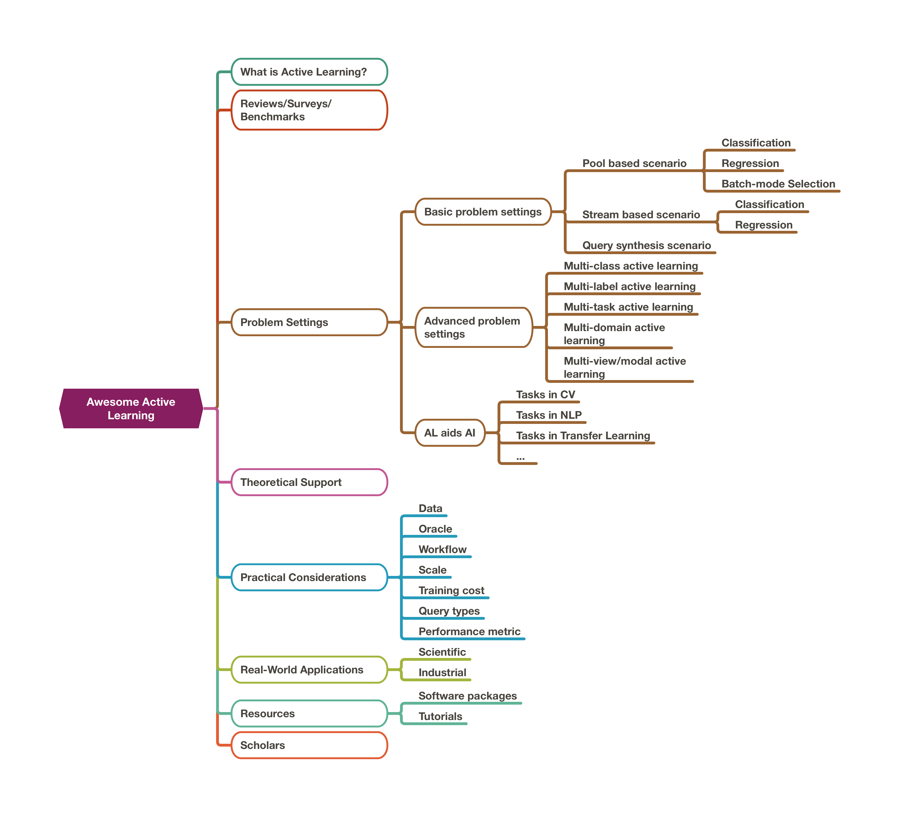

[![Contributors][contributors-shield]][contributors-url]
[![Forks][forks-shield]][forks-url]
[![Stargazers][stars-shield]][stars-url] 
[![Issues][issues-shield]][issues-url]

[contributors-shield]: https://img.shields.io/github/contributors/SupeRuier/awesome-active-learning.svg?style=for-the-badge
[contributors-url]: https://github.com/SupeRuier/awesome-active-learning/graphs/contributors

[forks-shield]: https://img.shields.io/github/forks/SupeRuier/awesome-active-learning.svg?style=for-the-badge
[forks-url]: https://github.com/SupeRuier/awesome-active-learning/network/members

[stars-shield]: https://img.shields.io/github/stars/SupeRuier/awesome-active-learning.svg?style=for-the-badge
[stars-url]: https://github.com/SupeRuier/awesome-active-learning/stargazers

[issues-shield]: https://img.shields.io/github/issues/SupeRuier/awesome-active-learning.svg?style=for-the-badge
[issues-url]: https://github.com/SupeRuier/awesome-active-learning/issues

[](https://awesome.re)
[](https://opensource.org/licenses/MIT)


<h1 align="center">
  Everything about Active Learning
</h1>

<h4 align="center">Everything you need about Active Learning (AL).</h4>
<h4 align="center">Not only a curated list, but also a well-structured library.</h4>
<!-- <h4 align="center">Usually updated twice a month.</h4> -->
<h4 align="center">关于主动学习你需要的一切.</h4>
<h4 align="center">不仅仅包含文献列表，更是一个结构化的资料库.</h4>
<!-- <h4 align="center">通常每月两更新.</h4> -->
<h4 align="center">(The majority of contents are presented in English.)</h4>

</p>

<!-- 一些超链接！！！ -->
<p align="center">
  <strong><a href="#0-papers---当前论文">Papers</a></strong> •
  <strong><a href="#1-introduction-to-al---主动学习简介">Introduction</a></strong> •
  <strong><a href="#tutorials---教程">Tutorials</a></strong> •
  <strong><a href="#2-reviews--tutorials---相关综述及教程">Survey</a></strong> •
  <strong><a href="#3-problem-settings---问题场景">Problem Settings</a></strong> •
  <strong><a href="#4-theoretical-support---理论支持">Theory</a></strong>
</p>
<p align="center">
  <strong><a href="#by-origin---按出处分类">Dissertations</a></strong> •
  <strong><a href="#7-codes--libraries---代码与工具包">Code & Library</a></strong> •
  <strong><a href="#8-scholars--groups---著名学者及团队">Scholars</a></strong> •
  <strong><a href="#6-real-world-applications---实际应用">Applications</a></strong>
</p>

[](#tutorials---教程)
<!-- **Widely used by top conferences and journals:** å
近期在多个顶尖会议与期刊中收录
- Conferences: 每一年的 CCF-A
- Journals: 每一年的 CCF-A -->


**Contributing - 加入本项目** 

If you find any valuable researches, please feel free to [pull request](https://github.com/SupeRuier/awesome-active-learning/pulls) or contact [ruihe.cs@gmail.com](ruihe.cs@gmail.com) to update this repository.
Comments and suggestions are also very welcome!

<!-- **Cite us - 引用我们:**

If you use our repository in your research or applications, please consider citing this website.
如果您在您的科研以及应用中从此项目获得一些帮助，请考虑使用如下的方式引用我们的项目。
```
@Misc{https://github.com/SupeRuier/awesome-active-learning,
howpublished = {\url{http://github.com/SupeRuier/awesome-active-learning}},   
title = {Everything about Active Learning},  
author = {Rui He}  
}  
``` -->

<!-- 
The hierarchical structure of this repository is shown in the following figure, and **you can find the paper-list in the corresponding sub-pages**:



--- -->


# 0. Papers - 当前论文

## By Origin - 按出处分类

By conference - 按会议分类：[**ICML**](conference/ICML.md) / [**NeurIPS**](conference/NeurIPS.md) / [**ICLR**](conference/ICLR.md) / [**AAAI**](conference/AAAI.md) / [**IJCAI**](conference/IJCAI.md) / [**ACL**](conference/ACL.md) / [**CVPR**](conference/CVPR.md) / [**ICCV**](conference/ICCV.md) 

By journal - 按期刊分类：[**AI**](journal/AI.md) / [**TPAMI**](journal/TPAMI.md) / [**IJCV**](journal/IJCV.md) / [**JMLR**](journal/JMLR.md)

By degree - 按学位论文分类：[**Master**](thesis/Master.md) / [**PhD**](thesis/PhD.md)

## By Content - 按内容分类

Constructed in a **problem-orientated** approach, which is easy for users to locate and track the problem.
基于**以问题为导向**的分类方式，以方便读者准确定位以及跟踪相关问题。

- [Taxonomy of Strategies - 主动学习技术分类](contents/pb_classification.md)
- [AL Problem Settings - 问题场景](#3-problem-settings---问题场景)
- [AL in other AI Fields - 其他人工智能领域中的主动学习](#33-al-in-ai-fields---人工智能背景中的主动学习)
- [Deep AL - 深度主动学习](contents/deep_AL.md)
- [Practical Considerations - 运用主动学习时的实际考虑](#5-practical-considerations---运用-al-时的考虑) 
- [AL Applications (Scientific & Industrial) - 主动学习在科学及工业界的应用](contents/AL_applications.md)

## By Hot Discussions - 按热门讨论分类

- [Intrinsic Issues in AL - 主动学习的内在问题](contents/intrinsic_issues.md)
- [Criticism / Discovery on Deep AL - 深度主动学习的批判和探索](contents/deep_AL_criticism.md)

# 1. Introduction to AL - 主动学习简介

**Problem - 面向的问题:** 
High labeling cost is common in machine learning community. 
Acquiring a heavy number of annotations hindering the application of machine learning methods.

**Essence / Assumption - 本质 / 基础假设:**
Not all the instances are equally important to the desired task, so only labeling the more important instances might bring cost reduction.

**When we talk about active learning, we talk about - 当我们在谈论主动学习时，我们指的是**:
- an approach to reduce the annotation cost in machine learning.
- the ways to select the most important instances for the corresponding tasks.
- (in most cases) an interactive labeling manner between algorithms and oracles.
- a machine learning setting where human experts could be involved.

# 2. Reviews & Tutorials - 相关综述及教程

There have been several reviews / surveys / benchmarks for this topic.

### **Reviews / Surveys - 综述**:
- [Active learning: theory and applications [2001]](https://ai.stanford.edu/~koller/Papers/Tong:2001.pdf.gz)
- [Active Learning Literature Survey **(Recommend to read)** [2009]](https://minds.wisconsin.edu/handle/1793/60660)
- [A survey on instance selection for active learning [2012]](https://link.springer.com/article/10.1007/s10115-012-0507-8)
- [Active Learning: A Survey [2014]](https://www.taylorfrancis.com/books/e/9780429102639/chapters/10.1201/b17320-27)
- [Active Learning Query Strategies for Classification, Regression, and Clustering: A Survey [2020, Journal of Computer Science and Technology]](https://link.springer.com/article/10.1007/s11390-020-9487-4)
- [A Survey of Active Learning for Text Classification using Deep Neural Networks [2020]](https://arxiv.org/pdf/2008.07267.pdf)
- [A Survey of Deep Active Learning [2020]](https://arxiv.org/pdf/2009.00236.pdf)
- [Active Learning: Problem Settings and Recent Developments [2020]](https://arxiv.org/pdf/2012.04225.pdf)
- [From Model-driven to Data-driven: A Survey on Active Deep Learning [2021]](https://arxiv.org/pdf/2101.09933.pdf)
- [Understanding the Relationship between Interactions and Outcomes in Human-in-the-Loop Machine Learning [2021]](http://harp.ri.cmu.edu/assets/pubs/hil_ml_survey_ijcai_2021.pdf): HIL, a wider framework.
- [A Survey on Cost Types, Interaction Schemes, and Annotator Performance Models in Selection Algorithms for Active Learning in Classification [2021]](https://arxiv.org/pdf/2109.11301.pdf)
- [A Comparative Survey of Deep Active Learning [2022]](https://arxiv.org/pdf/2203.13450.pdf)
- [A survey on online active learning [2023]](https://arxiv.org/pdf/2302.08893.pdf)
- Human‐in‐the‐loop machine learning: a state of the art [2023, Artificial Intelligence Review]

### **Benchmarks - 基线**:
- [A Comparative Survey: Benchmarking for Pool-based Active Learning [2021, IJCAI]](https://www.ijcai.org/proceedings/2021/0634.pdf)
- [A Framework and Benchmark for Deep Batch Active Learning for Regression [2022]](https://arxiv.org/pdf/2203.09410.pdf)
- [Re-Benchmarking Pool-Based Active Learning for Binary Classification [2023]](https://arxiv.org/pdf/2306.08954.pdf)
- [LabelBench: A Comprehensive Framework for Benchmarking Label-Efficient Learning [2023]](https://arxiv.org/pdf/2306.09910.pdf)

### **Tutorials - 教程**

|  Lecture Topic                                                                                                  | Year |           Lecturer           | Occasion      |
| --------------------------------------------------------------------------------------------------------------------- | ---- | :--------------------------: | ------------- |
| [Active learning and transfer learning at scale with R and Python](https://github.com/Azure/active-learning-workshop) | 2018 |              -               | KDD           |
| [Active Learning from Theory to Practice](https://www.youtube.com/watch?v=_Ql5vfOPxZU)                                | 2019 | Robert Nowak & Steve Hanneke | ICML          |
| [Overview of Active Learning for Deep Learning](https://jacobgil.github.io/deeplearning/activelearning)               | 2021 |       Jacob Gildenblat       | Personal Blog |


# 3. Problem Settings - 问题场景

## 3.1 Basic Scenarios - 基础问题场景

Almost all the AL studies are based on the following scenarios.
The difference lies in the different sources of the quired samples.
**The details of these scenarios could see [**here**](contents/AL_problem.md).**

**Three scenarios and corresponding tasks:**
- **pool-based - 基于数据池**: select from a pre-collected data pool
  - [pool-based classification](contents/pb_classification.md)
  - [pool-based regression](contents/pb_regression.md)
- **stream-based - 基于数据流**: select from a steam of incoming data
  - [stream-based classification](contents/sb_classification.md)
  - [stream-based regression](contents/sb_regression.md)
- **query synthesis - 基于数据生成**: generate query instead of selecting data
  - [query synthesis](contents/query-synthesis.md)


## 3.2 Advanced Problem Settings - 复杂问题场景

There are many variants of machine learning problem settings with **more advanced tasks**.
Under these problem settings, AL could be further applied.

**Related AL Fields:**
- [Multi-class AL - 多分类主动学习](contents/MCAL.md)
- [Multi-label AL - 多标签主动学习](contents/MLAL.md)
- [Multi-task AL - 多任务主动学习](contents/MTAL.md)
- [Multi-domain AL - 多领域主动学习](contents/MDAL.md):
- [Multi-view/modal AL - 多模态主动学习](contents/MVAL.md)
- [Multi-instance AL - 多样本主动学习](contents/MIAL.md)

## 3.3 AL in AI Fields - 人工智能背景中的主动学习

**Use AL to reduce the cost of annotation in many other AI research fields**, where the tasks beyonds simple classification or regression.
They either acquire different types of outputs or assume a unusual learning process.
So AL algorithms should be revised/developed for these problem settings.

**Utilize AL in the following fields (hot topics)：** 
- [Computer Vision (CV)](contents/AL_combinations.md#computer-vision-cv)
- [Natural Language Processing (NLP)](contents/AL_combinations.md#natural-language-processing-nlp)
- [Domain adaptation / Transfer learning](contents/AL_combinations.md#domain-adaptationtransfer-learning)
- [One / Few / Zero-shot learning or Meta-Learning](contents/AL_combinations.md#onefewzero-shot-learning-or-meta-learning)
- [Graph Processing](contents/AL_combinations.md#graph-processing)
- [Metric learning / Pairwise comparison/Similarity learning](contents/AL_combinations.md#metric-learningpairwise-comparisonsimilarity-learning)
- [Recommendation](contents/AL_combinations.md#recommendation)
- [Reinforcement Learning](contents/AL_combinations.md#reinforcement-learning)
- [Robotics](contents/AL_combinations.md#robotics)
- [Model Interpretability](contents/AL_combinations.md#model-interpretability)
- [Clustering](contents/AL_combinations.md#clustering)
- (Full list of fields could see [**here**](contents/AL_combinations.md))

# 4. Theoretical Support - 理论支持

There have been many theoretical supports for AL.
Most of them focus on finding a performance guarantee or the weakness of AL selection.

(This section has not been finished yet. 本章节当前还未完成.)

# 5. Practical Considerations - 运用 AL 时的考虑

Many researches of AL are built on very idealized experimental setting.
When AL is used to real life scenarios, the practical situations usually do not perfectly match the assumptions in the experiments.
These **changes of assumptions** lead issues which hinders the application of AL.
In this section, the practical considerations are reviewed under different assumptions.

**The considerations of:**
[data](contents/practical_considerations.md#the-considerations-of-the-data) / [oracle](contents/practical_considerations.md#the-considerations-of-the-oracles) / [scale](contents/practical_considerations.md#the-considerations-of-the-scale) / [workflow](contents/practical_considerations.md#the-consideration-of-the-workflow) / [model training cost](contents/practical_considerations.md#the-considerations-of-the-model-training-cost) / [query & feedback types](contents/practical_considerations.md#the-consideration-of-queryfeedback-types) / [performance metric](contents/practical_considerations.md#the-consideration-of-the-performance-metric) / [reliability](contents/practical_considerations.md#the-consideration-of-the-reliability) / [privacy](contents/practical_considerations.md#the-consideration-of-the-privacy) / [others](contents/practical_considerations.md#the-considerations-of-more-assumptions)

**The details and the full list could see [**here**](contents/practical_considerations.md).**

# 6. Real-World Applications - 实际应用

AL has already been used in many [real-world applications](contents/AL_applications.md).
For some reasons, the implementations in many companies are confidential.
But we can still find many applications from several published papers and websites.

Basically, there are two types of applications: [**scientific applications**](contents/AL_applications.md#scientific-applications-alphabetical-order) & [**industrial applications**](contents/AL_applications.md#industrial-applications-alphabetical-order).

# 7. Codes / Libraries - 代码与工具包

| Name                                                                                                               | Languages                        | Author                    | Notes                                            |
| ------------------------------------------------------------------------------------------------------------------ | -------------------------------- | ------------------------- | ------------------------------------------------ |
| [AL playground](https://github.com/google/active-learning)                                                         | Python(scikit-learn, keras)      | Google                    | Abandoned                                        |
| [modAL](https://github.com/modAL-python/modAL)                                                                     | Python(scikit-learn)             | Tivadar Danka             | Keep updating                                    |
| [libact](https://github.com/ntucllab/libact)                                                                       | Python(scikit-learn)             | NTU(Hsuan-Tien Lin group) |                                                  |
| [ALiPy](https://github.com/NUAA-AL/ALiPy)                                                                          | Python(scikit-learn)             | NUAA(Shengjun Huang)      | Include MLAL                                     |
| [pytorch_active_learning](https://github.com/rmunro/pytorch_active_learning)                                       | Python(pytorch)                  | Robert Monarch            | Keep updating & include active transfer learning |
| [DeepAL](https://github.com/ej0cl6/deep-active-learning)                                                           | Python(scikit-learn, pytorch)    | Kuan-Hao Huang            | Keep updating & deep neural networks             |
| [BaaL](https://github.com/ElementAI/baal/)                                                                         | Python(scikit-learn, pytorch)    | ElementAI                 | Keep updating & bayesian active learning         |
| [lrtc](https://github.com/IBM/low-resource-text-classification-framework)                                          | Python(scikit-learn, tensorflow) | IBM                       | Text classification                              |
| [Small-text](https://github.com/webis-de/small-text)                                                               | Python(scikit-learn, pytorch)    | Christopher Schröder      | Text classification                              |
| [DeepCore](https://github.com/PatrickZH/DeepCore)                                                                  | Python(scikit-learn, pytorch)    | Guo et al.                | In the coreset selection formulation             |
| [PyRelationAL: A Library for Active Learning Research and Development](https://github.com/RelationRx/pyrelational) | Python(scikit-learn, pytorch)    | Scherer et al.            |                                                  |
| [DeepAL+](https://github.com/SineZHAN/deepALplus/)                                                                 | Python(scikit-learn, pytorch)    | Zhan                      | An extension for DeepAL                          |
| [ALaaS](https://github.com/MLSysOps/alaas)                                                                         | Python(scikit-learn)             | A*STAR & NTU              | Use the stage-level parallellism for AL.         |

# 8. Scholars / Groups - 著名学者及团队

We also list several scholars who are currently heavily contributing to this research direction.

1. [Hsuan-Tien Lin](https://www.csie.ntu.edu.tw/~htlin/)
2. [Shengjun Huang](http://parnec.nuaa.edu.cn/huangsj/) (NUAA)
3. [Dongrui Wu](https://sites.google.com/site/drwuHUST/publications/completepubs) (Active Learning for Regression)
4. [Raymond Mooney](https://www.cs.utexas.edu/~mooney/)
5. [Yuchen Guo](http://ise.thss.tsinghua.edu.cn/MIG/gyc.html)
6. [Steve Hanneke](https://scholar.google.com/citations?hl=zh-CN&user=fEhNO7YAAAAJ&view_op=list_works&sortby=pubdate)

Several young researchers who provides valuable insights for AL:
- Jamshid Sourati [University of Chicago]: Deep neural networks.
- Stefano Teso [University of Trento]: Interactive learning & Human-in-the-loops.
- Xueyin Zhan [City University of Hong Kong]: Provide several invaluable comparative surveys.
- Katerina Margatina [University of Sheffield]: Provide several good insights, analysis and applications for AL.

