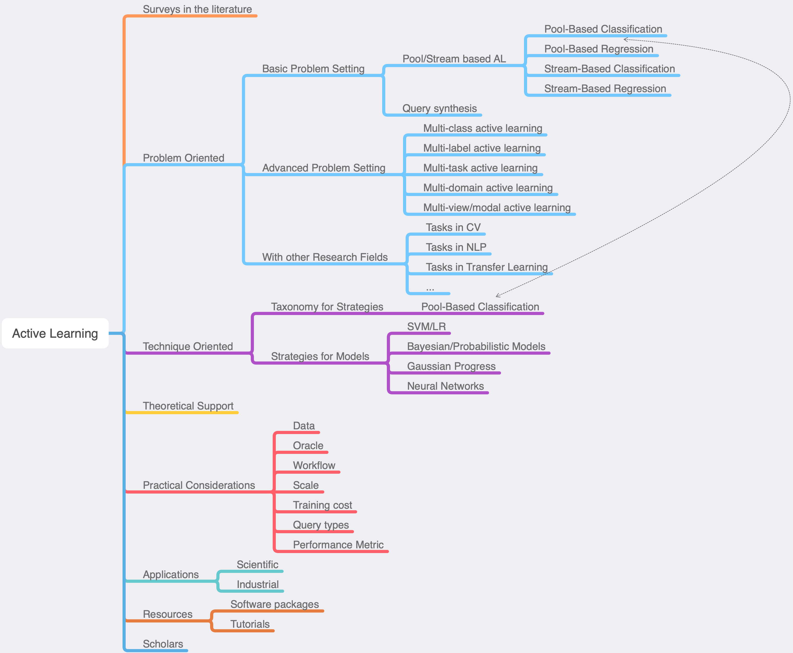

# Awesome Active Learning

In this repository, previous works of active learning were categorized. 
We try to summarize the current AL works in both **problem-orientated** and **technique-orientated** approaches.
Except the research papers, we also include many real-world applications of AL in this repository.
The open-source software resources and the information of relevant scholars are listed.

**We assume the readers already have the basic knowledge of active learning.**

*(I can't ensure this summary covers all the representative works and ideas.
So if you have any comments and recommendations, pls let me know.)*

- [Awesome Active Learning](#awesome-active-learning)
- [At the Beginning (Reviews/Surveys)](#at-the-beginning-reviewssurveys)
- [Problem-oriented approach](#problem-oriented-approach)
  - [Basic Problem Settings](#basic-problem-settings)
  - [Advanced Problem Settings](#advanced-problem-settings)
  - [Problem Settings from other AI Research Fields](#problem-settings-from-other-ai-research-fields)
- [Technique-oriented Approach](#technique-oriented-approach)
  - [Taxonomy for AL Strategies (Pool-based Classification)](#taxonomy-for-al-strategies-pool-based-classification)
  - [AL Strategies with specific models](#al-strategies-with-specific-models)
- [Theoretical Support for Active Learning](#theoretical-support-for-active-learning)
- [Practical Considerations when Applying AL](#practical-considerations-when-applying-al)
- [Real-World Applications of AL](#real-world-applications-of-al)
- [Resources:](#resources)
  - [Software Packages/Libraries](#software-packageslibraries)
  - [Tutorials](#tutorials)
- [Groups/Scholars](#groupsscholars)

# At the Beginning (Reviews/Surveys)

Active learning is used to reduce the annotation cost in machine learning process.
It is under the assumption that some samples are more important for a given task than other samples.
There have been several surveys for this topic.
They provided a good overview for the field.

- Active learning: theory and applications [[2001]](https://ai.stanford.edu/~koller/Papers/Tong:2001.pdf.gz)
- **Active Learning Literature Survey (Recommend to read)**[[2009]](https://minds.wisconsin.edu/handle/1793/60660)
- A survey on instance selection for active learning [[2012]](https://link.springer.com/article/10.1007/s10115-012-0507-8)
- Active Learning: A Survey [[2014]](https://www.taylorfrancis.com/books/e/9780429102639/chapters/10.1201/b17320-27)
- Active Learning Query Strategies for Classification, Regression, and Clustering: A Survey [[2020, Journal of Computer Science and Technology]](https://link.springer.com/article/10.1007/s11390-020-9487-4)
- A Survey of Active Learning for Text Classification using Deep Neural Networks [[2020]](https://arxiv.org/pdf/2008.07267.pdf)
- A Survey of Deep Active Learning [[2020]](https://arxiv.org/pdf/2009.00236.pdf)
- ALdataset: a benchmark for pool-based active learning [[2020]](https://arxiv.org/pdf/2010.08161.pdf)
- Active Learning: Problem Settings and Recent Developments [[2020]](https://arxiv.org/pdf/2012.04225.pdf)
- [From Model-driven to Data-driven: A Survey on Active Deep Learning [2021]](https://arxiv.org/pdf/2101.09933.pdf)
- [Understanding the Relationship between Interactions and Outcomes in Human-in-the-Loop Machine Learning [2021]](http://harp.ri.cmu.edu/assets/pubs/hil_ml_survey_ijcai_2021.pdf): HIL, a wider framework.

# Problem-oriented approach

Firstly, we summarized the previous works in a problem-oriented order.
We note that, in this section we don't focus on what the algorithms look like.
However, we try to identify the exact problem settings and list the applicable methods (or works) for the corresponding settings.
In other words, we need to understand what specific problems active learning is trying to solve.

We divided the problem settings into three types:
1. Basic Problem Settings
   - Under the basic scenarios: Pool-based/Stream-based/Query synthesis
   - Under the basic tasks: Classification/Regression
2. Advanced Problem Settings
   - Under many variants of machine learning problem settings.
3. Problem Settings from other Research Fields
   - With more complex tasks or problem settings in other research fields

## Basic Problem Settings

According to three types of scenarios and two basic tasks, almost all the AL works could be divided into the following sub-problems.
Please check [**here**](AL_problem.md) for more details.

|                | Pool-based                     | Stream-based         | Query synthesis |
| -------------- | ------------------------------ | -------------------- | :-------------: |
| Classification | PB-classification (most works) | SB-classification    |        -        |
| Regression     | PB-regression                  | SB-regression (rare) |        -        |

## Advanced Problem Settings

There are many variants of machine learning problem settings.
Under these problem settings, AL could be further applied.

- [Multi-class active learning](subfields/MCAL.md): In a classification task, each instance has one label from multiple classes (more than 2).
- [Multi-label active learning](subfields/MLAL.md): In a classification task, each instance has multiple labels.
- [Multi-task active learning](subfields/MTAL.md): The model or set of models handles multiple different tasks simultaneously. For instance, handle two classification tasks at the same time, or one classification and one regression. 
- [Multi-domain active learning](subfields/MDAL.md): Similar to multi-task, but the data are from different datasets(domains). The model or set of models handles multiple datasets simultaneously.
- [Multi-view/modal active learning](subfields/MVAL.md): The instances might have different views (different sets of features). The model or set of models handles different views simultaneously.

## Problem Settings from other AI Research Fields

In many AI research fields, the problem settings can't be simply divided into supervised classification or regression problem.
They either acquire different types of outputs or assume a unusual learning process.
So AL algorithms should be revised/developed for these problem settings.
Here we summarized several research fields which use AL to reduce the cost of annotation.

- Computer Vision (CV)
- Natural Language Processing (NLP)
- Domain adaptation/Transfer learning
- Metric learning/Pairwise comparison/Similarity learning
- One/Few/Zero-shot learning
- Graph Processing
- Clustering
(We didn't list all of them in this section.)

The full list of works could see [**here**](subfields/AL_combinations.md)

# Technique-oriented Approach

This section contains two parts：
- Taxonomy for AL strategies
- AL strategies under different models

There might be overlaps between these two parts. 
Here we just provide two different dimensions for you to find the information you need.

## Taxonomy for AL Strategies (Pool-based Classification)

In this section, we provide our taxonomy in the current AL strategies.
We hope this can bring you a intuition to design your own strategy or just choose the most appropriate strategy.
We note that the taxonomy we used here is focusing on **pool-based classification**.
We summarized the way to calculate the score of instances into the following categories.

| Score                     | Description                                       | Comments                                                                                              |
| ------------------------- | ------------------------------------------------- | ----------------------------------------------------------------------------------------------------- |
| Informativeness           | Uncertainty by the model prediction               | Neglect the underlying distribution.                                                                  |
| Representativeness-impart | Represent the underlying distribution             | Normally used with informativeness. This type of methods may have overlaps with batch-mode selection. |
| Expected Improvements     | The improvement of the model's performance        | The evaluations usually take time.                                                                    |
| Learn to score            | Learn a evaluation function directly.             |                                                                                                       |
| Others                    | Could not classified into the previous categories |                                                                                                       |

For more details, the list of works with short introductions could see [**here**](subfields/pb_classification.md).

## AL Strategies with specific models

There are model-free AL strategies and model-dependent AL strategies.
However, even the same strategy might be implement differently on different models.
Different strategies are also designed for different models by take into account the models' characteristic.
So we summarized the previous works for several models.
Hopefully this could help you easily find a appropriate AL strategy for your current model.

Model list:
- SVM/LR
- Bayesian/Probabilistic Models
- Gaussian Progress
- Neural Network

Please check [**here**](AL_technique_models.md) form more details (Not finished yet).

# Theoretical Support for Active Learning

<!-- TODO: Might fill this slot later. -->
(Not finished yet)

# Practical Considerations when Applying AL

When we use AL in real life scenarios, the practical situations usually are not perfectly matching our problem settings which are introduced above.
The data, the oracle, the scale and many other situations could be really different to the experimental settings.
In other words, this section is about what else need to be considered to meet the needs in practical problems for applying AL strategies.
Here we list the practical considerations for AL.

| Type               | Practical Considerations                                         |
| ------------------ | ---------------------------------------------------------------- |
| Data               | Imbalanced data                                                  |
|                    | Cost-sensitive case                                              |
|                    | Logged data                                                      |
|                    | Feature missing data                                             |
|                    | Multiple Correct Outputs                                         |
|                    | Unknown input classes                                            |
|                    | Different data types                                             |
|                    | Data with Perturbation                                           |
| Oracle             | The assumption change on single oracle (Noise/Special behaviors) |
|                    | Multiple/Diverse labeler (ability/price)                         |
| Workflow           | Cold start                                                       |
|                    | Stop criteria                                                    |
| Scale              | Large-scale                                                      |
| Training cost      | Take into account the training cost                              |
|                    | Incrementally Train                                              |
| Query types        | Provide other feedbacks other than just labels                   |
| Performance metric | Other than the learning curves                                   |

The list of works could see [**here**](subfields/practical_considerations.md).

# Real-World Applications of AL

We have introduced that AL could be used in many [other research fields](subfields/AL_combinations.md).
In fact, AL has already been used in many real-world applications.
For many reasons, the implementations in many companies are confidential.
But we can still find many applications from several published papers and websites.

Basically, there are two types of applications: **scientific applications** & **industrial applications**.
We summarized a list of works [**here**](subfields/AL_applications.md).

# Resources:

## Software Packages/Libraries
There already are several python AL projects:
- [Google's active learning playground](https://github.com/google/active-learning)
- [A modular active learning framework for Python](https://github.com/modAL-python/modAL)
- [libact: Pool-based Active Learning in Python](https://github.com/ntucllab/libact)
- [ALiPy](https://github.com/NUAA-AL/ALiPy): 
  An AL tool-box from NUAA. 
  The project is leaded by Shengjun Huang.
- [pytorch_active_learning](https://github.com/rmunro/pytorch_active_learning)
- [Deep-active-learning](https://github.com/ej0cl6/deep-active-learning)
- [Paladin](https://www.aclweb.org/anthology/2021.eacl-demos.28.pdf): An anotation tool for creat- ing high-quality multi-label document-level datasets.

## Tutorials
- [active-learning-workshop](https://github.com/Azure/active-learning-workshop): 
  KDD 2018 Hands-on Tutorial: Active learning and transfer learning at scale with R and Python

# Groups/Scholars

We also list several scholars who is currently contributing to this research direction.

<!-- TODO: need to be updated. -->

1. [Hsuan-Tien Lin](https://www.csie.ntu.edu.tw/~htlin/)
2. [Shengjun Huang](http://parnec.nuaa.edu.cn/huangsj/) (NUAA)
3. [Dongrui Wu](https://sites.google.com/site/drwuHUST/publications/completepubs) (Active Learning for Regression)
4. Raymond Mooney
5. [Yuchen Guo](http://ise.thss.tsinghua.edu.cn/MIG/gyc.html)

<!-- 

# Our Subjective Opinions on AL

Active learning has been researched over 3 decades, the fundamental theories and ideas are quite complete.
Current works are more focusing on apply AL on other research fields or looking for new applications of AL.

In my point of view, there are several directions which are promising but not fully discovered:
- Deep active learning: Because of the popularity of the deep models.
  - Cold start
  - Uncertainty measurement
  - Efficiently update model in AL process
- Stream based active learning: Most works are about pool-based AL, but the data steam is also heavily-used in daily life.
  - Selection strategy.
- Large scale active learning: AL is invented for high labeling cost situation. However, most works are just try their algorithms on a relatively small dataset.
- Practical considerations: Before utilize AL into realistic situation, there still are many technical problems.
- Application scenarios 

-->